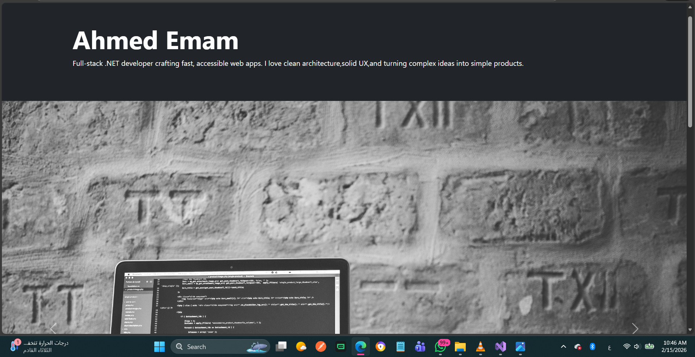

# 💼 Personal Portfolio Website – Ahmed Emam

A modern and responsive **Personal Portfolio Website** built using **HTML5** and **Bootstrap 5**.

This project is designed to showcase a developer profile in a clean professional way, including featured projects, an about section, and contact information.

---
## 📌 Project Overview

This portfolio website includes:

* ✅ Hero Section (Developer Name + Intro)
* ✅ Responsive Navigation Layout
* ✅ Bootstrap Carousel Slider
* ✅ Featured Projects Section (Cards UI)
* ✅ About Me Section
* ✅ Contact Section (Email Button)
* ✅ Footer Section
* ✅ Fully Responsive Design (Mobile-Friendly)

---

## 🛠 Tech Stack

* **HTML5**
* **Bootstrap 5.3**
* **Bootstrap Carousel**
* **Bootstrap Grid System**
* **Responsive UI Design**

---

## ✨ Main Sections

### 🟦 Hero Section

A professional header that introduces the developer with a clean dark theme layout.

### 🎠 Carousel Section

An interactive Bootstrap carousel with:

* slide indicators
* next / previous buttons
* responsive full-width images

### 📂 Featured Projects

A grid of project cards showing:

* project image
* title
* short description
* "View Project" button

### 👤 About Me

A short professional description card.

### 📬 Contact Section

A contact card with a direct email button.

---

## 📷 Screenshots

### 🏠 Home / Hero Section



### 🎠 Carousel Section


### 📂 Featured Projects Section


### 📬 About & Contact Section


---

## 📂 Project Structure

```
Portfolio/
│
├── index.html
├── README.md
└── docs/
    ├── home.png
    ├── carousel.png
    ├── projects.png
    └── about.png
```

---

## ⚙️ Setup & Run

1️⃣ Clone the repository:

```bash
git clone https://github.com/kholouddiaa/portfolio-website.git
```

2️⃣ Open the folder:

```bash
cd your-repo-name
```

3️⃣ Run the project:
Just open `index.html` in your browser.

---

## 🌍 Deployment (GitHub Pages)

To deploy:

1. Go to **Settings**
2. Open **Pages**
3. Select:

   * Branch: `main`
   * Folder: `/root`
4. Click **Save**
5. Your site will be available at:
---

## 🚀 Future Enhancements

* Add real project links
* Add GitHub + LinkedIn buttons
* Add download CV button
* Add animations (AOS / CSS effects)
* Add dark/light mode

---

## 👨‍💻 Author

**Ahmed Emam**
Full-stack .NET Developer

---

## 📄 License

This project is created for educational and portfolio purposes.
